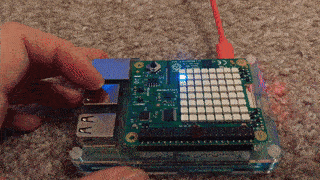
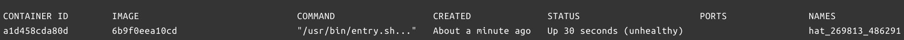

# Healthcheck with Sense HAT

Demo project of using the Docker [`HEALTHCHECK`](https://docs.docker.com/engine/reference/builder/#healthcheck) functionality for a resin.io project.

It's a simple web application, that displays a wandering pixel on a [Sense HAT](https://www.raspberrypi.org/products/sense-hat/) and can be put in an `unhealthy` state using the Sense HAT's joystick (just click the joystick and the application goes into an unhealthy state). The health is signaled through a lockfile. `Dockerfile`'s `HEALTHCHECK` command will check the existence of that lockfile, and if the check fails, it will restart the service automatically:

```
HEALTHCHECK --start-period=5s --timeout=2s --interval=3s --retries=1 \
    CMD if [ ! -e "/tmp/working" ]; then exit 1; fi
```

Here the `--start-period`, `--timeout`, `--interval`, and `--retries` values are set to pretty short so that the demo works quickly, in your application you need to set them as appropriate (see th default values on the linked `HEALTHCHECK` docs page above).

To use this, [deploy the code on resin.io](https://docs.resin.io/learn/getting-started/raspberrypi3/nodejs/) on a Raspberry Pi, and attach a Sense HAT. Here it is in action:



If logged in to the device's Host OS, `balena ps` will show the state of the containers, and whether or not they are healthy:


